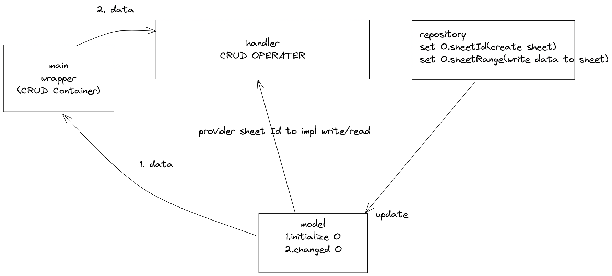
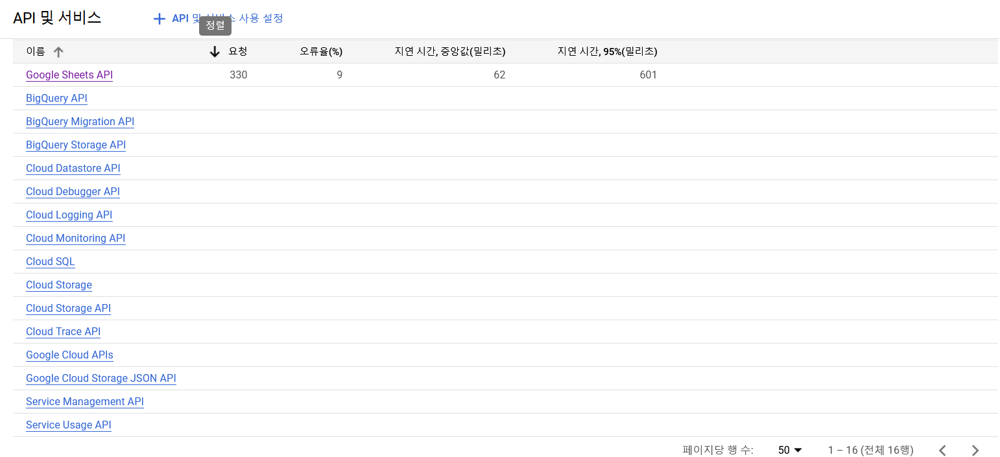
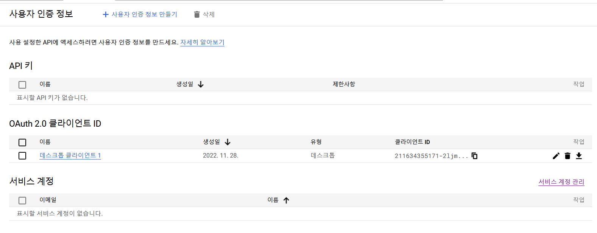
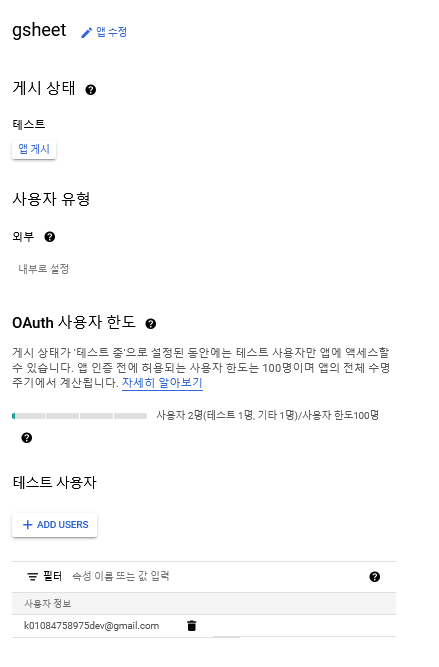

# Gsheet Provider for Iracing Data

## Struct


# Src
```
# repo
https://github.com/quimcalpe/iracing-sdk

# gsheet settings / funcs
https://developers.google.com/sheets/api/guides/values#python
```

# Settings



